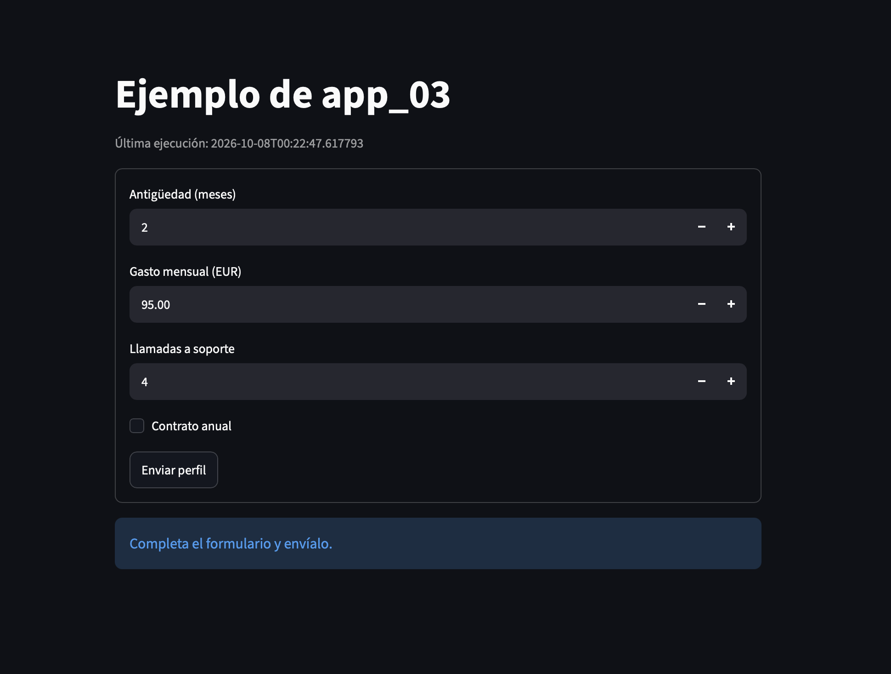

# Streamlit web app demos

This repository contains brief examples of the Python Streamlit library.

You can run any of the scripts from `app_01.py` to `app_04.py`. Each of them demonstrates different applications of Streamlit. You can easily follow the code and see which widgets (such as checkboxes, buttons, etc.) Streamlit displays.

`app_04.py` calls a mock LLM, which is located in `demo_streamlit_s5_20261007_200403_272110`.

## How to run the code

```bash
uv run streamlit run app_01.py
```

You can modify the script, and the website will show a "Rerun" button to display your saved changes.

## Why use Streamlit?

Useful for:
- Showing demos
- Visualizing projects
- Avoiding presenting a raw Python script to your boss

[Streamlit website](https://streamlit.io)

Example:


